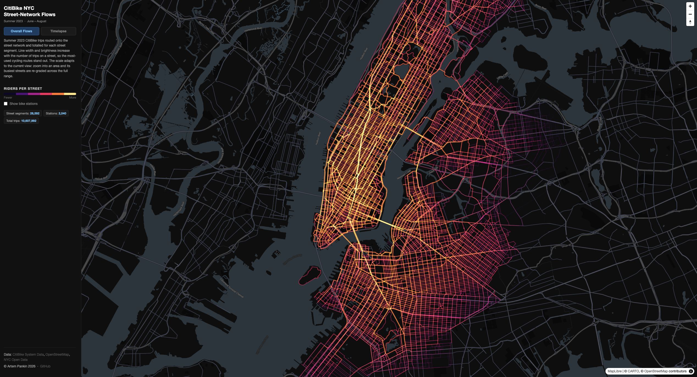

# CitiBike NYC — Street-Network Routing & Flow Timelapse

An end-to-end data pipeline that routes CitiBike summer-2023 trips along NYC streets using
**PostgreSQL / PostGIS / pgRouting**, then visualises them as a **deck.gl + MapLibre** web map
with two views: an aggregated bike-flow heatmap and an animated trip timelapse.

**Stack:** PostgreSQL · PostGIS · pgRouting · Python · DuckDB-WASM · deck.gl · MapLibre GL



<video src="https://github.com/user-attachments/assets/8d9b1227-bc2f-4d92-a650-bf30729adf00" controls width="100%"></video>

---

## Quick start

```bash
# 1. Create conda environment (installs Postgres + PostGIS + pgRouting + Python)
make env
conda activate citibike

# 2. Copy and edit connection settings
cp .env.example .env          # adjust ports/passwords if needed

# 3. Initialise per-project Postgres cluster (no sudo required)
make db-init

# 4. Run the full pipeline
make all                      # downloads data, loads DB, routes, exports (~1–2 h)

# 5. Build the centerline network + route (required by make timelapse, included in make all)
make centerline

# 6. Open the web map
make serve                    # visit http://localhost:8000
```

`make all` runs: `data → db → profile → route → clean-network → export → centerline → timelapse → tiles`

> `timelapse` depends on the centerline routing (`.cscl_routed`), so `make centerline` is not a separate optional step — it is included automatically.

---

## Repository layout

```
.
├── environment.yml              conda-forge environment (DB + Python, no system installs)
├── Makefile                     orchestrates the full pipeline
├── .env.example                 DB connection + runtime parameters
├── profile_data.py              feasibility probe (run after make db)
│
├── data/                        local data store — gitignored, re-creatable via make data/timelapse
│   ├── raw/                     raw downloads: CSVs, OSM .pbf, borough + CSCL GeoJSON
│   └── parquet/                 intermediate Parquet files (CSV → Parquet conversion)
│
├── pipeline/
│   ├── 00_setup.sql             CREATE EXTENSION postgis, pgrouting; CREATE TABLE data
│   ├── 01_download_data.py      fetch 2023-06/07/08 CSVs, borough GeoJSON, OSM .pbf
│   ├── 02_load_trips.py         CSV → Parquet → chunked COPY into data table
│   ├── 03_stations.sql          build bike_stations (dedup, drop NJ, tag borough)
│   ├── 04_trips.sql             build trips + od_pairs (directed)
│   │
│   ├── 05_network.sql           osm2pgrouting import, clip to NYC, snap station vertices
│   ├── 06_route_od.sql          pgr_dijkstra routing over all OD pairs → edge_flows (OSM)
│   ├── 06_route_od_batch.py     alternative parallel runner for the same routing step
│   ├── 06_route_od_proc.sql     routing helper queries
│   │
│   ├── 05b_centerline_network.py   build routing graph from NYC Street Centerline (CSCL)
│   ├── 06b_route_centerline_batch.py  parallel pgr_dijkstra on CSCL graph → od_routes_cl
│   ├── 06b_route_centerline.sql    CSCL routing queries
│   │
│   ├── 07_export.py             write edge_flows.geojson + stations.geojson
│   ├── 08_clean_network.py      snap OSM edges to CSCL geometry; sum flows
│   ├── 08b_aggregate_variants.py   generate lwavg / max count-de-inflation variants
│   ├── 09_timelapse.sql         materialise per-trip geometry + timestamps
│   └── 10_export_parquet.py     write docs/data/trips/day=*/part-0.parquet
│
└── docs/
    ├── index.html               deck.gl + MapLibre dark map (two switchable views)
    ├── trip-processor.worker.js off-main-thread geometry decoder for timelapse
    ├── server.py                local dev server
    └── data/                   generated outputs (tracked in git for easy deployment)
        ├── edge_flows.geojson          primary flow dataset (OSM-routed, CSCL-snapped)
        ├── edge_flows_lwavg.geojson    length-weighted-avg de-inflation variant
        ├── edge_flows_max.geojson      max de-inflation variant
        ├── edge_flows_cl.geojson       centerline-routed flow dataset (make centerline-export)
        ├── edge_flows.pmtiles          vector tiles
        ├── stations.geojson            station locations + departure counts
        ├── timelapse_meta.json         date-range metadata for the timelapse slider
        ├── trips_timelapse.json        legacy full-trip JSON (superseded by Parquet partitions)
        └── trips/                      Hive-partitioned Parquet (day=YYYY-MM-DD/) — gitignored
```

---

## Pipeline stages

### Path A — OSM network (`make route`)

| Step | Script | Description |
|---|---|---|
| 00 | `00_setup.sql` | Create extensions and schema |
| 01 | `01_download_data.py` | Fetch CitiBike CSVs, borough GeoJSON, Geofabrik OSM extract |
| 02 | `02_load_trips.py` | CSV → Parquet → `COPY` to `data` table |
| 03–04 | `03_stations.sql`, `04_trips.sql` | Deduplicate stations; build directed OD pairs |
| 05 | `05_network.sql` | `osm2pgrouting` import, clip to NYC, snap station vertices |
| 06 | `06_route_od.sql` | `pgr_dijkstra` over all OD pairs → `edge_flows` (parallel alternative: `06_route_od_batch.py`) |
| 07 | `07_export.py` | Write `edge_flows.geojson`, `stations.geojson` |
| 08 | `08_clean_network.py` | Re-snap OSM edges to CSCL geometry; sum flows |
| 08b | `08b_aggregate_variants.py` | Generate `_lwavg` and `_max` count-de-inflation variants |

### Path B — NYC Centerline (`make centerline`)

| Step | Script | Description |
|---|---|---|
| 05b | `05b_centerline_network.py` | Build routing graph from NYC CSCL Open Data |
| 06b | `06b_route_centerline_batch.py` | Parallel `pgr_dijkstra` on CSCL graph → `od_routes_cl` |
| — | `centerline-export` | Export `edge_flows_cl.geojson` |

### Post-processing

| Target | Description |
|---|---|
| `make timelapse` | Materialise per-trip geometry + timestamps → Hive-partitioned Parquet |
| `make tiles` | Generate `edge_flows.pmtiles` with `tippecanoe` |

---

## Design decisions

| Decision | Choice | Reason |
|---|---|---|
| Period | Summer 2023 (Jun–Aug) | Latest complete summer at time of development |
| Routing granularity | Per distinct OD pair (directed) | Route once, reuse geometry for all trips on that pair |
| Direction | Directed (`cost` / `reverse_cost`) | A→B ≠ B→A; one-ways enforced |
| Street network | NYC CSCL (primary) + OSM (fallback) | CSCL matches NYC's authoritative street geometry; OSM used for initial routing before CSCL snap |
| Count de-inflation | `lwavg` and `max` variants | OSM routes onto highways/expressways; variants redistribute counts to the likely-intended streets |
| Timelapse format | Hive-partitioned Parquet by day | DuckDB-WASM loads only the days in the current playback window via HTTP range reads |
| Toolchain | Single conda env, per-project `pg_ctl` cluster | Reproducible, no sudo |
| Storage | CSV → Parquet → chunked COPY | Memory-efficient on large datasets |
| Visualisation | deck.gl `TripsLayer` + `GeoJsonLayer` over MapLibre | Current spatial-DS idiom, no token required |
| Animation | Off-main-thread Web Worker | Geometry decoding keeps the map thread responsive during Parquet loading |

### Routing scale

Run `make profile` after loading data to see the actual numbers. Typical summer-2023 figures:
- ~10.6 million trips, ~938,000 distinct routed geometries, ~15,000 distinct OD pairs (directed)
- Each OD pair is routed once; all trips sharing that pair reuse the same geometry
- Top ~5,000 pairs cover ~90% of all trips
- Routing all pairs takes ~30 min on a laptop (Apple Silicon)

Override at runtime: `psql -v N_OD_PAIRS=5000 -f pipeline/06_route_od.sql`

---

## Web map views

**Overall Flows**
Street edges coloured and weighted by `total_trips` across the full summer.
The colour scale re-grades dynamically as you zoom and pan — the busiest streets in the current viewport set the anchor.
Station markers sized by departure count.

**Timelapse**
deck.gl `TripsLayer` animating sampled trips as glowing trails along their routed street paths.
DuckDB-WASM streams per-day Parquet partitions on demand; a Web Worker decodes geometry off the main thread.
A time slider sweeps June 1 → August 31 (compressed to ~3 minutes). Playback speed: 0.5× / 1× / 2× / 4×.

---

## Data sources

| Dataset | Source |
|---|---|
| CitiBike trip data | [CitiBike System Data](https://citibikenyc.com/system-data) |
| NYC Borough Boundaries | [NYC Open Data](https://data.cityofnewyork.us) |
| NYC Street Centerline (CSCL) | [NYC Open Data – Centerline](https://data.cityofnewyork.us/City-Government/NYC-Street-Centerline-CSCL-/exjm-f27b) |
| Street network (OSM) | [Geofabrik New York extract](https://download.geofabrik.de/north-america/us/new-york.html) via osm2pgrouting |
